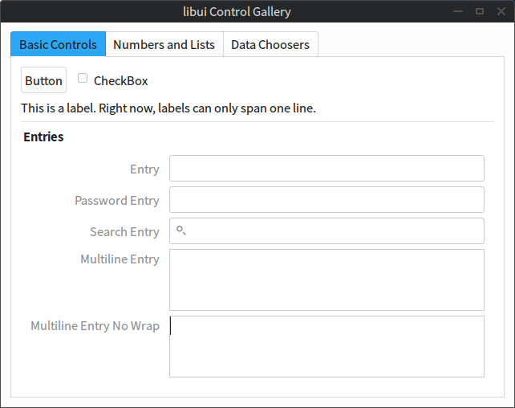
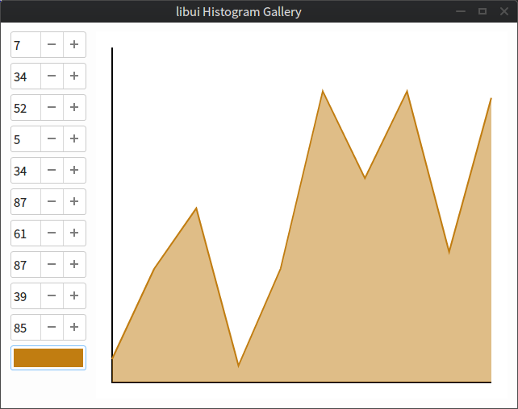
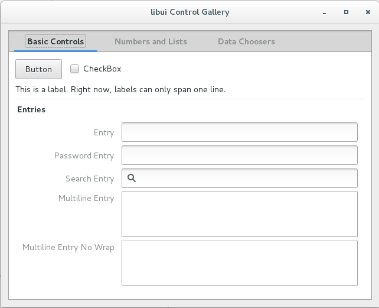
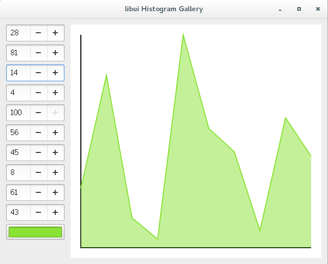
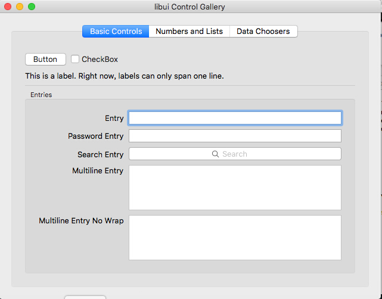
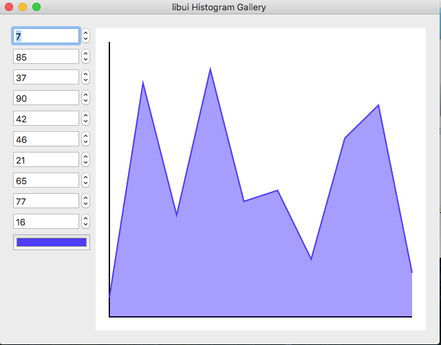
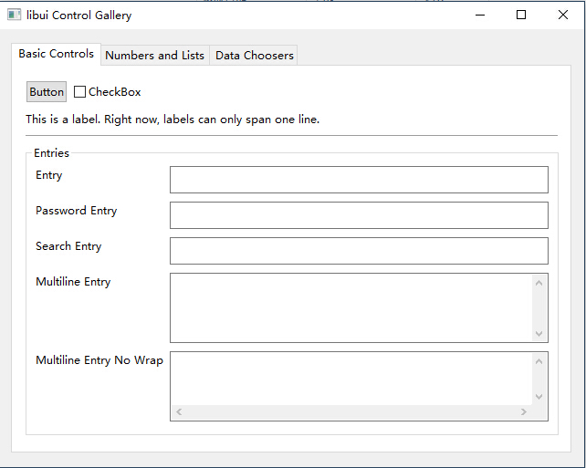
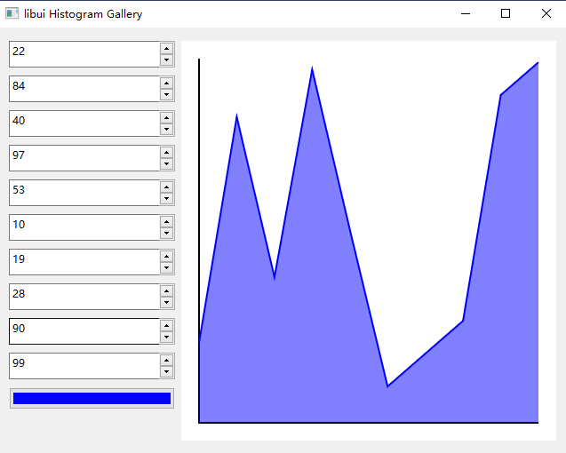

# DevZH.UI  [![License][License]](LICENSE-2.0.txt) [![][NuGet]](https://www.nuget.org/packages/DevZH.UI/)

[License]: https://img.shields.io/badge/license-Apache_2.0-blue.svg?style=flat-square
[NuGet]: https://img.shields.io/nuget/v/DevZH.UI.svg?style=flat-square

> .NET Core Bindings for [libui](https://github.com/andlabs/libui)

> libui is a simple and portable (but not inflexible) GUI library in C that uses the native GUI technologies of each platform it supports.

## Supported platform

It supports the [platform](https://github.com/dotnet/core/blob/master/roadmap.md#technology-roadmaps) which is supported by .NET Core. 

And it requires some extra runtime.

### Runtime Requirements
* Unix: GTK+ 3.10 or newer

## Screenshots
**Linux ( Deepin 2014.2 based on Ubuntu 14.04 )**

**Linux ( CentOS 7 with GNOME 1511 )**

**macOS ( 10.11 )**

**Windows ( Windows 10 x64 )**

